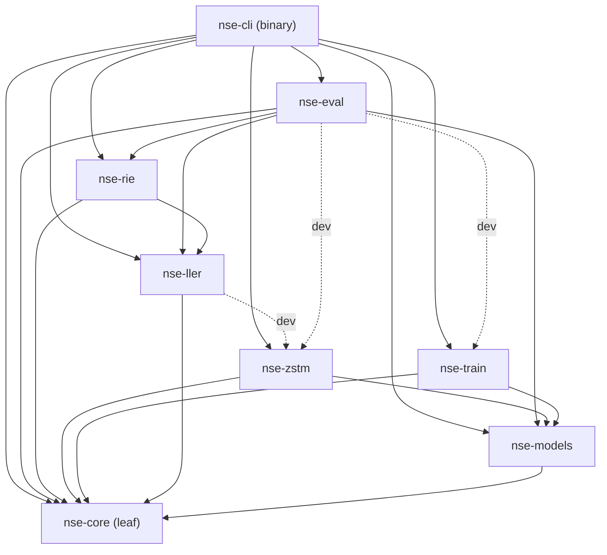

# Architecture — Neuro-Sparse Engine (NSE)

Tài liệu này là deep-dive textual vào thiết kế hệ thống NSE — một prototype
nghiên cứu bằng Rust khảo sát khả năng chạy LLM trên CPU/Edge không cần GPU
cluster. NSE gồm 8 crate tổ chức thành một Cargo workspace, với 3 trục chính:
**ZSTM** (biến đổi dense → sparse), **RIE** (routing/indexing), và **LLER**
(kernel cấp thấp), cộng một đường ống training thay thế (SGD/FF/Hopfield/LSH-sparse/Composite)
và evaluation (PPL dense/sparse).

> Phiên bản trực quan của các sơ đồ trong tài liệu này được giữ tại
> [`docs/diagrams.md`](docs/diagrams.md).

---

## 1. Tổng quan workspace

NSE là Cargo workspace (`resolver = "2"`) 8 crate, edition 2021, rust-version
1.75. Mỗi crate có một vai trò rõ ràng và doc comment `//!` ở đầu `lib.rs` mô tả
nó. Workspace metadata (version, edition, license MIT) được khai báo trong
`[workspace.package]` của `Cargo.toml` gốc và kế thừa qua `*.workspace = true`.

| Crate | Vai trò | Module chính |
|---|---|---|
| `nse-core` | Core types, errors, format `.nse` (mmap), sparse structs | `sparse`, `format`, `tensor`, `error` |
| `nse-models` | Toy LM (transformer), tokenizer char-level, autograd thủ công, safetensors I/O | `toy_lm`, `tokenizer`, `autograd`, `loader`, `config` |
| `nse-train` | `Trainer` trait + SGD (real) + FF/Hopfield/LSH-sparse (real) + Composite (M7) | `trainer`, `sgd`, `forward_forward`, `hopfield`, `lsh_sparse`, `composite` |
| `nse-zstm` | Zero-Shot Transmutation: outlier + k-means + ternary/PQ | `outlier`, `cluster`, `quantize`, `pq`, `transmuter` |
| `nse-rie` | Routing & Indexing: MIPS brute/HNSW + threshold router + bias compensator + dispatch | `index`, `hnsw`, `router`, `bias` |
| `nse-ller` | Low-Level Execution: scalar reference kernel + AVX2 + dispatch | `kernel`, `avx2`, `tiling` |
| `nse-eval` | PPL dense/sparse + Hopfield forward + compare reports (4-path composite) | `ppl`, `sparse_forward`, `compare` |
| `nse-cli` | Binary `nse`: train / transmute / eval subcommands | `cli` |

---

## 2. Đồ thị dependency crate

Các cạnh solid là runtime dependency (đọc từ `Cargo.toml` của từng crate). Các
cạnh dashed là `dev-dependency` (chỉ dùng cho test/example/benchmark, không có
runtime cycle). `nse-core` là leaf (không phụ thuộc crate nội nào); mọi crate
khác build lên trên nó.



**Đọc đồ thị**: `nse-zstm` và `nse-train` cùng phụ thuộc `nse-core` + `nse-models`
(biến đổi/training đọc dense weights). `nse-rie` phụ thuộc `nse-ller` (router
gọi kernel để đánh giá expert) + `nse-core`. `nse-eval` phụ thuộc cả `nse-rie`
và `nse-ller` (orchestrator sparse forward + kernel). `nse-cli` phụ thuộc tất cả
(orchestrator toàn pipeline). Lưu ý `nse-ller` dev-dependency `nse-zstm` **chỉ
cho example `bench_pq`** — không tạo runtime cycle (comment trong
`crates/nse-ller/Cargo.toml` xác nhận).

---

## 3. Data flow end-to-end

Pipeline chạy theo thứ tự tuyến tính, mỗi giai đoạn sinh một artifact trung
gian để debug riêng:

```text
ToyLm (random init)
   │  nse train / train-composite        (nse-train: SGD / CompositeTrainer)
   ▼
toy_lm.safetensors  ──── dense weights (FP32)
   │  nse transmute [--quant pq]         (nse-zstm: outlier → cluster → quantize)
   ▼
model.nse  ────────────── TransmutedModel serialized (JSON, mmap-able)
   │  nse eval-sparse / eval-compare     (nse-rie + nse-ller + nse-eval)
   ▼
sparse_forward(model.nse, tokens) → logits → PPL_sparse
   │                                      compare với PPL_dense
   ▼
CompareReport { PPL_dense, PPL_sparse, degradation, active_fraction }
```

**Chi tiết từng bước**:

1. **Train**: `SgdTrainer` (hoặc `CompositeTrainer`) train Toy LM qua backprop,
   lưu `ToyLmWeights` ra `.safetensors`.
2. **Transmute (ZSTM, offline)**: `transmute(lm, corpus, cfg)` đọc dense weights,
   thu thập mean input activations từ corpus, rồi với mỗi weight matrix `W[out,in]`
   chạy 3 stage (outlier → cluster → quantize) sinh `SparseLayer`, gom thành
   `TransmutedModel`, `save_transmuted` serialize ra `.nse` (JSON).
3. **Sparse inference (online)**: `load_transmuted` đọc `.nse`, `sparse_forward`
   thay mỗi matmul dense bằng `sparse_linear` (RIE route + LLER kernel), ra logits.
4. **Eval**: `sparse_ppl` tính PPL từ logits; `compare` chạy cả dense (`ToyLm`
   forward) và sparse, tính degradation tương đối + active_fraction.

Quan trọng: ZSTM **không retrain** — đây là xấp xỉ zero-shot. Degradation vs dense
chỉ từ (1) quantization error (ternary/PQ) và (2) bias dùng mean activation thay
cho token thật (mode threshold).

---

## 4. Key data structures

Tất cả định nghĩa trong `crates/nse-core/src/sparse.rs`, dùng chung bởi ZSTM
(produce), RIE+LLER (consume), và eval (compare).

### 4.1 `SparseLayer` — một linear layer transmuted `W[out,in] -> y[out]`

```rust
pub struct SparseLayer {
    pub out_dim: usize,
    pub in_dim: usize,
    pub dense_core: Matrix,          // outlier rows, FP32, always active
    pub core_row_ids: Vec<u32>,     // original row ids of dense_core
    pub experts: Vec<MicroExpert>,  // micro-experts covering non-core rows
    pub bias: Vec<f32>,             // static bias B[out] for pruned experts
    pub mean_input: Vec<f32>,       // mean activation [in] from transmute corpus
    #[serde(default)]
    pub pq_codebook: Option<PqCodebook>, // shared PQ codebook (Some iff any expert uses PQ)
}
```

Sparse forward: `y = W_core·x + Σ_{activated k} expert_k(x, rescaled) +
Σ_{pruned k} B[rows_k]`. `bias[i] = W[i]·mean_input` cho prunable rows, 0 cho
core rows (luôn compute exact).

### 4.2 `MicroExpert` — một cụm row được quantize

```rust
pub struct MicroExpert {
    pub row_ids: Vec<u32>,       // output-row indices this expert owns
    pub ternary: Vec<i8>,        // {-1,0,1} codes, rows*in_dim, unused when pq=Some
    pub row_scales: Vec<f32>,    // per-row scale s (reconstruct = s*ternary), unused when pq=Some
    pub centroid: Vec<f32>,      // routing target in input space [in], score = x·centroid
    pub mean_input: Vec<f32>,    // bias bookkeeping
    #[serde(default)]
    pub pq: Option<PqExpertData>, // None → ternary path; Some → PQ path
}
```

### 4.3 Ternary vs PQ — quyết định quant scheme

Scheme được set tại ZSTM time qua `QuantSchemeConfig` trong
`crates/nse-zstm/src/transmuter.rs`:

```rust
pub enum QuantSchemeConfig {
    Ternary,                       // {-1,0,1} + per-row scale (BitNet), default
    Pq { num_sub_vectors, nbits, iters, seed }, // 8-bit codebook (256 levels/sub-vector)
}
```

- **Ternary** (default, backward-compat): 3 level per weight, scale theo hàng.
  Thô — gây +82% sparse degradation (paper §5.2) nhưng cheap + đơn giản.
- **PQ** (M8): mỗi row chia thành `M` sub-vector, mỗi sub-vector quantize vs
  codebook 8-bit (256 centroid) học được, **codebook shared per layer** (< 1 MB,
  L3 cache). Per-row scale `s = mean(|w|)` giữ magnitude chính xác, codebook chỉ
  học *shape* trên row chuẩn hóa `w/s`. Giảm degradation +32.8% → +18.4% (dim=64).

Dispatch kernel theo `MicroExpert.pq`: `Some` → PQ kernel (decode vs
`SparseLayer::pq_codebook`), `None` → ternary kernel. Layer thường đồng nhất
(all experts cùng scheme), nhưng dispatch xử lý mixed layer defensive.

### 4.4 `PqCodebook` + `PqExpertData` (M8)

```rust
pub struct PqCodebook {
    pub num_sub_vectors: usize,    // M
    pub nbits: usize,              // 8 → 256 centroids per sub-codebook
    pub sub_dim: usize,            // = in_dim / num_sub_vectors
    pub codebook: Vec<f32>,        // [subvec m][centroid c][dim j]
}                                  // codebook[m*(2^nbits)*sub_dim + c*sub_dim + j]

pub struct PqExpertData {
    pub codes: Vec<u8>,            // rows * num_sub_vectors bytes, row-major
    pub row_scales: Vec<f32>,      // decode = scale * concat(reconstructed subvecs)
    pub num_sub_vectors: usize,    // cached for kernel indexing
}
```

Geometry fallback: nếu `in_dim` không chia hết cho `M`, dùng ước số lớn nhất
`≤ M` (dim=30, M=4 → M=3; prime → M=1 = plain VQ) — CLI không panic.

### 4.5 `TransmutedModel` — toàn bộ mô hình transmuted

```rust
pub struct TransmutedModel {
    pub config: ConfigStub,         // vocab/dim/layers/heads (không phụ thuộc nse-models)
    pub token_embed: Matrix,        // [vocab, dim], kept dense
    pub layers: Vec<[SparseLayer; 4]>, // per-layer: [qkv, attn_out, ff_up, ff_down]
    pub ln1_gain: Vec<Vec<f32>>,    // layernorm gains kept dense
    pub ln2_gain: Vec<Vec<f32>>,
    pub ln_f_gain: Vec<f32>,
}
```

`ConfigStub` mirror tối giản của `nse_models::Config` để sparse forward chạy mà
không phụ thuộc `nse-models` (tránh dependency cycle — `nse-core` không thể
phụ thuộc `nse-models`). Convert qua `From` impl.

### 4.6 `#[serde(default)]` Option — backward-compat design

Cả `MicroExpert.pq` và `SparseLayer.pq_codebook` đều có
`#[serde(default)]` trên `Option`, nên **`model.nse` ternary-only cũ
deserialize thành `None`** → chạy ternary kernel như cũ, không break. Đây là
thiết kế backward-compat cốt lõi: thêm PQ (M8) không phá M0–M7. `--quant ternary`
(default) giữ nguyên reproduce số liệu paper §5.2–5.6; `--quant pq` bật đường PQ.

---

## 5. ZSTM — Zero-Shot Transmutation (3 stage, offline)

`transmute_matrix(W, mean_input, cfg)` trong `transmuter.rs` chạy 3 stage:

```text
Stage 1: outlier  (crates/nse-zstm/src/outlier.rs)
  extract(W) → dense_core [n_core, in] (outlier rows theo chuẩn)
             + residual [n_out - n_core, in] + residual_row_ids
  dense_core luôn active (L1 cache path)

Stage 2: cluster  (crates/nse-zstm/src/cluster.rs)
  spherical k-means(residual) → centroids [K, in] + members[K] (row indices)
  mỗi centroid = một micro-expert, group theo direction trong input space

Stage 3: quantize  ── branch theo cfg.quant ──┐
  ├─ Ternary  (quantize.rs): per expert, quantize member rows → {-1,0,1} + scale
  │    build_ternary_experts() → MicroExpert{pq: None}
  └─ PQ      (pq.rs): train shared codebook trên normalized residual rows
       (per-sub-vector L2 k-means, 8-bit), encode each expert's rows
       build_pq_experts() → MicroExpert{pq: Some(PqExpertData)} + PqCodebook
```

Sau 3 stage, tính **static bias** `B[out]`: `B[i] = W[i]·mean_input` cho prunable
rows, 0 cho core rows. Bias scheme-agnostic (dùng original W, không phải quantized
form). `mean_input` được ước lượng từ corpus qua `mean_inputs_for` (forward dense,
collect pre-activations cho 4 matmul mỗi layer); nếu corpus = None, means = 0 →
bias = 0 (baseline hợp lệ, lossy).

Kết quả: `SparseLayer{out_dim, in_dim, dense_core, core_row_ids, experts, bias,
mean_input, pq_codebook}`, gom 4 layer mỗi block thành `[SparseLayer; 4]` (qkv,
attn_out, ff_up, ff_down).

---

## 6. RIE — Routing & Indexing (online)

Mỗi token, RIE chọn tập con micro-expert để kích hoạt mà không scan toàn model.
Ba thành phần trong `crates/nse-rie/src/`:

### 6.1 Index (MIPS) — `index.rs` + `hnsw.rs`

- **Brute-force** (`MipsIndex`): exact MIPS O(N), canonical. Score = `x · centroid`
  cho mỗi expert.
- **HNSW** (`HnswIndex`): đồ thị phân tầng thật — cấp mỗi nút
  `l ~ floor(−ln(u)·mL)`, `mL = 1/ln(M)`; chèn greedy descent (ef=1) tầng cao +
  beam search (ef_construction) mỗi tầng, link bidirectional M-neighbor với pruning.
  Query: greedy descent xuống tầng 1, beam search tầng 0 (ef_search), trả top-K.
  `ensure_connected_layer0` (BFS từ entry point, kết nối nút cô lập) đảm bảo
  recall@k = 1 trên đồ thị nhỏ. Backend chọn qua `IndexKind { Brute, Hnsw }`.

`MipsQuery` trait trừu tượng "trả mọi hit sắp xếp theo score giảm" để router làm
việc với cả hai backend.

### 6.2 Router — `router.rs`

Hai chế độ kích hoạt:
- **`route_all`** (All): mọi expert → upper bound; chỉ lỗi quantization, không
  pruning (bias = 0 on average).
- **`route_by_ratio`** (Threshold): giữ expert có score ≥ `max_score · ratio`,
  cap `max_k`. Pruned expert → đóng góp thay bằng bias.

### 6.3 Bias compensator — `bias.rs`

`apply_bias`: cộng `B[i]` cho pruned rows để bù contribution trung bình (unbiased
on average, lossy per-token).

### 6.4 `sparse_linear_with_kernel` — primitive RIE+LLER

```rust
pub fn sparse_linear_with_kernel(sl: &SparseLayer, x: &[f32],
                                 activated: &[usize], kind: KernelKind) -> Vec<f32>
```

Flow: `y = 0`; `compute_dense_core_dispatch` (always); for each activated expert
dispatch theo `expert.pq`: `Some` + codebook → `compute_pq_micro_expert_dispatch`,
`None` → `compute_ternary_micro_expert_dispatch` (defensive: expert claims PQ
nhưng layer thiếu codebook → skip, degrade gracefully); cuối cùng
`apply_bias`. `sparse_linear_all` = activate mọi expert (upper bound).

---

## 7. LLER — Kernel dispatch (scalar vs AVX2, ternary vs PQ)

`crates/nse-ller/src/` — kernel cấp thấp với **scalar = canonical ground truth**
dùng cho PPL, AVX2 = tối ưu phải match scalar trong 1e-5.

### 7.1 Kernel kind + dispatch

`KernelKind { Scalar, Avx2, Auto }` — `Auto` = AVX2 nếu
`is_x86_feature_detected!("avx2")`, else scalar. Các hàm `*_dispatch` trong
`avx2.rs` chọn runtime, có scalar fallback.

### 7.2 Ternary kernel — add/sub/skip

- **Scalar** (`compute_ternary_micro_expert_scalar`): decode ternary per-row,
  `acc = Σ scale * (ternary_j * x_j)` — branch per-element (add/sub/skip).
- **AVX2** (`compute_ternary_micro_expert_avx2`): giải mã ternary thành 2 mask
  (mask_pos/mask_neg, 0xFFFFFFFF giữ / 0 bỏ), `pos = _mm256_and_ps(x, mask_pos)`,
  `accum = add(accum, pos) − neg`, 8 float/iter, tail vô hướng cùng thứ tự,
  horizontal-reduce theo thứ tự vô hướng.

### 7.3 Dense core kernel — FMA

- **Scalar** (`compute_dense_core`): dot product mỗi row.
- **AVX2** (`compute_dense_core_avx2`): `_mm256_fmadd_ps` mỗi row, 7.2× speedup
  trên toy (FMA đầy đủ).

### 7.4 PQ kernel — gather + dot (M8)

- **Scalar** (`compute_pq_micro_expert_scalar`): decode-inline + dot — tight loop
  (nhanh hơn ternary scalar 6.8× vì không branch per-element).
- **AVX2** (`compute_pq_micro_expert_dispatch`): FMA gather codebook lookup +
  accumulate 8-lane. 1.92× speedup vs scalar PQ (dim=64); PQ AVX2 (61µs) nhanh
  hơn ternary AVX2 (87µs) 30% trên dim=64 — trái dự đoán "gather expensive" vì
  FMA chặt lookup. Trên sub_dim lớn (≥32) gather cost có thể đảo ngược — tài liệu
  hóa trung thực (paper §5.7.5).

### 7.5 Tiling — `tiling.rs`

No-op trong POC — expert đã cache-sized do ZSTM. Scaffold cho phase tối ưu sau.

---

## 8. Training — `Trainer` trait + 5 backend

`crates/nse-train/src/` — `Trainer` trait trừu tượng hóa "train Toy LM", 5
backend implement nó:

| Backend | Module | Cơ chế | Backprop? |
|---|---|---|---|
| `SgdTrainer` | `sgd.rs` | vanilla backprop + momentum + gradient clip toàn cục | đầy đủ |
| `ForwardForwardTrainer` | `forward_forward.rs` | Hinton FF: goodness cục bộ per-block, positive/negative, softplus loss, `weight_clip` ức chế | không toàn cục |
| `HopfieldTrainer` | `hopfield.rs` | modern Hopfield: one-shot writes vào FFN (key/value), retrieval softmax | không (ghi 1 lần) |
| `LshSparseTrainer` | `lsh_sparse.rs` | dense backprop + LSH gradient masking (che theo hàng, ~sparse_fraction update/step) | đầy đủ + mask |
| `CompositeTrainer` | `composite.rs` | orchestrator 4-phase qua `Trainer` trait | tùy phase |

`sgd_apply` (momentum + clip) dùng chung bởi SGD + LSH-sparse. `hopfield_retrieve`
export cho test/caller verify recall.

### 8.1 CompositeTrainer — 4-phase (M7, hippocampus + cortex)

Phân vai trò giống thần kinh học (routing/learning/memory tách rời), chạy tuần tự:

1. **SGD warm** (*stabilizer*): vài epoch backprop đặt model vào basin tốt.
2. **Hopfield writes** (*hippocampus*): one-shot associative writes vào FFN.
3. **Forward-Forward** (*local plasticity*): per-block goodness + `weight_clip`
   0.5 (sweet spot paper §5.4), không backprop toàn cục.
4. **LSH-sparse fine-tune** (*routing + sparse update*): backprop dày đặc + che
   gradient theo LSH, chỉ ~1% trọng số update/step.

Mỗi phase **skip khi epoch/write = 0**. Default = FF 15 + LSH 15 (skip SGD +
Hopfield) theo phát hiện §5.4.2: FF warm-start + LSH fine-tune là tổng hợp hiệu
quả. Composite thắng từng trainer riêng (21.44 vs FF 26.04, LSH 24.12, Hopfield
62.40) cùng compute, **không thắng SGD** (12.37) — đúng kỳ vọng (backprop đầy đủ
mạnh nhất trên toy), tài liệu hóa trung thực.

---

## 9. Evaluation — PPL + Hopfield + 4-path composite

`crates/nse-eval/src/` — đo perplexity, headline metric của POC.

### 9.1 `ppl.rs`

- `dense_ppl` — PPL của `ToyLm` dense forward.
- `sparse_ppl` / `sparse_ppl_with_options` — PPL của `TransmutedModel` qua
  `sparse_forward` (RIE route + LLER kernel), chọn `--kernel` + `--index`.
- `dense_ppl_hopfield` / `sparse_ppl_hopfield` — PPL với forward-path Hopfield
  retrieval (softmax `β·(ff_up·k)` thay GELU) — kiểm mismatch hypothesis §5.4.3.

### 9.2 `sparse_forward.rs`

Sparse forward pass over `TransmutedModel`, mirror dense forward nhưng thay mỗi
matmul bằng `sparse_linear` (4 matmul mỗi layer: qkv, attn_out, ff_up, ff_down).
`Activation { Gelu, Hopfield }` chọn forward-path FFN. `SparseOptions` gói
`KernelKind` + `IndexKind`.

### 9.3 `compare.rs`

- `compare` → `CompareReport { PPL_dense, PPL_sparse, degradation, active_fraction }`
  — báo cáo so sánh dense vs sparse.
- `compare_composite` → `CompositeReport` — **4-path**: dense/sparse ×
  GELU/Hopfield, in degrade tương đối. Artifact chính của M7. Kết quả quan
  trọng: sparse Hopfield trên ternary keys = **negative result** (ternary phá
  cosine structure của `ff_up` keys → retrieval phẳng) — tài liệu hóa giới hạn,
  hướng mở: giữ `ff_up` dense hoặc dùng PQ codebook thay ternary.

---

## 10. CLI — `nse` binary

`crates/nse-cli/src/cli.rs` — `nse` với 10 subcommand, mỗi cái sinh artifact
trung gian để debug riêng:

| Subcommand | Vai trò |
|---|---|
| `train` | SGD baseline → `.safetensors` |
| `train-ff` | Forward-Forward → `.safetensors` |
| `train-hopfield` | Hopfield writes → `.safetensors` |
| `train-lsh` | LSH-sparse → `.safetensors` (hỗ trợ `--init` warm-start) |
| `train-composite` | Composite 4-phase → `.safetensors` |
| `transmute` | ZSTM → `.nse` (`--quant ternary`/`pq`, `--pq-subvectors`, `--pq-nbits`) |
| `eval-dense` | PPL dense |
| `eval-sparse` | PPL sparse (`--kernel scalar/avx2/auto`, `--index brute/hnsw`) |
| `eval-compare` | báo cáo so sánh dense/sparse |
| `eval-composite` | báo cáo 4-path (dense/sparse × GELU/Hopfield) |

---

## 11. Tham khảo

- `paper/PAPER.md` — báo cáo nghiên cứu đầy đủ: kết quả thực nghiệm, phân tích
  failure mode (§5.4 FF/Hopfield), PQ codebook (§5.7), giới hạn trung thực (§6).
- `docs/01-nse-inference-spec.md` — spec inference (format `.nse`, RIE, LLER).
- `docs/02-training-vision.md` — vision training thay thế.
- `README.md` — README tổng quan + pipeline POC.
- `CONTRIBUTING.md` — dev setup, code style, cách mở rộng, PR process.
- `CHANGELOG.md` — lịch sử milestone M0–M8.
