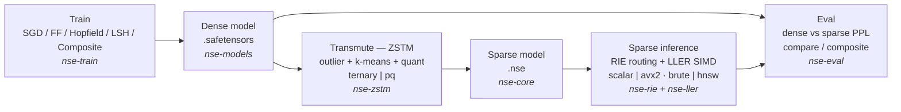

# Neuro-Sparse Engine (NSE)

> **Chạy LLM thưa trên CPU/Edge — không cần GPU cluster.**
> ZSTM transmutation + RIE routing + LLER SIMD kernels.

NSE là một framework nghiên cứu bằng Rust nhằm chạy mô hình ngôn ngữ (LLM) dưới
dạng **thưa (sparse)** và **lượng tử hóa** trên CPU/Edge, loại bỏ phụ thuộc vào
GPU cluster lớn. Phiên bản hiện tại là một prototype chạy end-to-end trên một toy
LM (transformer nhỏ) — đo sụt giảm chất lượng (PPL) giữa dense và sparse, và chứng
minh pipeline huấn luyện → biến đổi thưa → suy luận thưa → đánh giá.


---

## Mục lục

- [NSE là gì?](#nse-là-gì)
- [Kiến trúc tổng quan](#kiến-trúc-tổng-quan)
- [Workspace](#workspace)
- [Build & test](#build--test)
- [Quickstart](#quickstart)
- [Trạng thái (Milestones M0-M9)](#trạng-thái-milestones-m0-m9)
- [Kết quả POC (Key results)](#kết-quả-poc-key-results)
- [Giới hạn (Honest limitations)](#giới-hạn-honest-limitations)
- [Tài liệu](#tài-liệu)
- [License](#license)
- [Trích dẫn (Citation)](#trích-dẫn-citation)

---

## NSE là gì?

Chi phí GPU lớn đang là rào cản cho việc huấn luyện và suy luận LLM. NSE đặt câu
hỏi: **có thể chạy — và ở một mức độ nào đó, huấn luyện — mô hình trên phần cứng
thưa/CPU/edge?** Framework này tiếp cận vấn đề ở cấp độ prototype, tách biệt suy
nghiệm khỏi huấn luyện dày đặc: sau khi một LM dense được huấn luyện bằng phương
pháp thông thường, nó được "biến đổi" sang dạng thưa lượng tử hóa và chỉ một tập
con nhỏ trọng số được kích hoạt mỗi token.

NSE gồm ba trục kỹ thuật chính. **ZSTM** (Zero-Shot Transmutation) biến một mô
hình dense thành đồ thị thưa động lượng tử hóa (ternary `{−1,0,+1}` hoặc Product
Quantization 8-bit) **không cần retrain**. **RIE** (Routing & Indexing) định
tuyến O(log N) qua chỉ mục HNSW để chỉ kích hoạt một tập con các chuyên gia
(micro-experts) mỗi token. **LLER** (Low-Level Execution) cung cấp kernel SIMD
(AVX2) cấp thấp với fallback vô hướng để đánh giá các nhân thưa với chi phí nhỏ.

Bên cạnh đường ống suy luận, NSE triển khai **ba thuật toán huấn luyện thay thế**
để khảo sát học không phụ thuộc backprop toàn cục: Forward-Forward (Hinton),
bộ nhớ liên tưởng Hopfield, và LSH-sparse training — cùng một kiến trúc tổng hợp
"hippocampus + cortex" (M7) orchestrate bốn phase. Toàn bộ hệ thống chạy
end-to-end: huấn luyện → lượng tử hóa → suy luận thưa → so sánh PPL, với kết quả
thực đo trên toy LM và tài liệu hóa trung thành về giới hạn.

---

## Kiến trúc tổng quan

NSE là một Cargo workspace 8 crate. Mỗi giai đoạn pipeline là một crate riêng để
có thể debug độc lập: `nse-train` huấn luyện LM dense (`ToyLm`, transformer nhỏ)
lưu safetensors; `nse-zstm` biến đổi dense → thưa (`TransmutedModel`, định dạng
`.nse`); suy luận thưa dùng `nse-rie` (định tuyến) + `nse-ller` (kernel SIMD); và
`nse-eval` so sánh PPL dense vs sparse. CLI `nse-cli` nối tất cả qua các
subcommand.



Sơ đồ chi tiết và design deep-dive chuyên biệt (`docs/diagrams.md`,
`ARCHITECTURE.md`) đang được dựng — xem [Tài liệu](#tài-liệu). Cho đến lúc đó,
bản mô tả kiến trúc đầy đủ nhất nằm trong [paper/PAPER.md](paper/PAPER.md) (§2
Kiến trúc, §3 Thuật toán huấn luyện, §5.7 PQ codebook).

---

## Workspace

| Crate | Vai trò |
|---|---|
| `nse-core` | Types, errors, format `.nse` (mmap); `SparseLayer` / `MicroExpert` / `PqCodebook` / `TransmutedModel` |
| `nse-models` | Toy LM (transformer) + tokenizer (char-level) + safetensors loader |
| `nse-train` | `Trainer` trait + SGD (real) + FF/Hopfield/LSH-sparse (real) + Composite (M7) |
| `nse-zstm` | ZSTM offline transmutation: outlier + k-means + quant **ternary hoặc PQ** |
| `nse-rie` | MIPS index (brute/HNSW) + threshold router + bias compensator + `sparse_linear_with_kernel` (dispatch ternary/PQ) |
| `nse-ller` | Kernel vô hướng + AVX2 (ternary add/sub/skip; PQ gather+dot) + `KernelKind` dispatch |
| `nse-eval` | PPL dense/sparse + Hopfield forward + báo cáo compare + 4-path composite |
| `nse-cli` | CLI `nse`: `train` / `train-composite` / `eval-dense` / `eval-sparse` / `eval-compare` / `eval-composite` / `transmute` (`--quant ternary\|pq`) |

---

## Build & test

Yêu cầu Rust 1.75+ (xem `[workspace.package] rust-version` trong
[Cargo.toml](Cargo.toml)).

```bash
cargo build --workspace
cargo test --workspace
```

Lưu ý về thời gian test: `cargo test --workspace` chạy sạch **56 test** nhưng ở
debug build mất **~40 phút** tổng cộng (các test huấn luyện chạy nhiều epoch). Để
chạy nhanh hơn các test huấn luyện:

```bash
cargo test --workspace --release        # build tối ưu — test training chạy nhanh hơn nhiều
```

---

## Quickstart

Binary CLI là `nse`. Chưa cài đặt thì thay `nse` bằng
`cargo run --release -- <subcommand>`. Các lệnh dưới dùng dạng `cargo run` để chạy
ngay không cần bước cài.

### Đường dim=32 (nhanh)

```bash
cargo run --release -- train      --epochs 10 --out lm32.safetensors
cargo run --release -- transmute  --model lm32.safetensors --out lm32.nse --quant ternary
cargo run --release -- eval-compare --model lm32.safetensors --nse lm32.nse
```

Kết quả dự kiến (paper §5.2, dim=32, SGD 10 epoch, all-experts):

| Đường | PPL | Degradation |
|---|---:|---:|
| Dense | 20.50 | — |
| Sparse ternary | 37.29 | **+82%** |

Degradation +82% phản ánh **chi phí lượng tử hóa ternary** (3 level `{−1,0,1}`
quá thô cho trọng số Gaussian-centered) — đây là upper bound (all-experts, chỉ
lỗi lượng tử hóa, không pruning). Đây chính là động lực cho PQ ở M8.

### Đường dim=64 với PQ (M8)

```bash
# 1. Huấn luyện (dim=64, ff_dim=128, 20 epoch)
cargo run --release -- train --dim 64 --ff-dim 128 --epochs 20 --out lm64.safetensors

# 2. Transmute sang hai schema: ternary (baseline) và PQ
cargo run --release -- transmute --model lm64.safetensors --out lm64_tern.nse --quant ternary
cargo run --release -- transmute --model lm64.safetensors --out lm64_pq.nse   --quant pq --pq-subvectors 4

# 3. So sánh PPL
cargo run --release -- eval-compare --model lm64.safetensors --nse lm64_tern.nse   # +32.8% (ternary)
cargo run --release -- eval-compare --model lm64.safetensors --nse lm64_pq.nse     # +18.4% (PQ)

# 4. Benchmark kernel PQ + reconstruction MSE
cargo run --release --example bench_pq -p nse-ller
```

Kết quả dự kiến (paper §5.7, dim=64, SGD 20 epoch, all-experts):

| Đường | PPL | Degradation |
|---|---:|---:|
| Dense | 13.531 | — |
| Sparse ternary | 17.973 | **+32.8%** |
| Sparse PQ (M=4) | 16.017 | **+18.4%** |

PQ **giảm degradation gần một nửa** (+32.8% → +18.4%). `pq/ternary = 0.891` — PQ
thắng 11% trên sparse PPL, trên cùng mô hình SGD, cùng corpus, cùng activation,
chỉ khác quantization scheme.

Lệnh `eval-compare` in báo cáo dạng:

```text
=== NSE POC: Dense vs Sparse PPL ===
PPL dense  : <ppl_dense>
PPL sparse : <ppl_sparse>
degradation: +<pct>%
avg active : <frac>% of params/token
activation : all-experts (upper bound)
```

(Chi tiết format ở [`crates/nse-eval/src/compare.rs`](crates/nse-eval/src/compare.rs);
CLI in 4 chữ số thập phân cho PPL và 2 cho %.)

### Transmute: các flag quantization

| Flag | Giá trị | Mô tả |
|---|---|---|
| `--quant` | `ternary` (mặc định) \| `pq` | Lược đồ lượng tử hóa. `ternary` giữ backward-compat với số liệu §5.2–5.6. |
| `--pq-subvectors` | `4` (mặc định) | Số sub-vector `M` (dùng với `--quant pq`); `in_dim` phải chia hết cho `M`, hệ thống tự lấy ước số lớn nhất `≤ M`. |
| `--pq-nbits` | `8` (mặc định) | Bit/code (8 → 256 centroids/sub-codebook). |

### Các flag backend suy luận thưa

| Flag | Giá trị | Áp dụng cho |
|---|---|---|
| `--kernel` | `scalar` \| `avx2` \| `auto` (mặc định) | `eval-sparse`, `eval-compare`, `eval-composite` |
| `--index` | `brute` (mặc định) \| `hnsw` | `eval-sparse`, `eval-compare`, `eval-composite` |
| `--mode` | `all` (mặc định) \| `threshold` | `eval-sparse` (`--threshold-ratio`, `--max-k` khi threshold) |
| `--forward` | `gelu` (mặc định) \| `hopfield` | `eval-dense` (`--beta` khi hopfield) |
| `--beta` | `8.0` (mặc định) | `eval-composite`, `eval-dense --forward hopfield` |

> Kernel (scalar/AVX2) và index (brute/HNSW) chỉ thay đổi *cách* đánh giá, không
> kết quả — PPL phải khớp ngoài FP noise (paper §5.2).

---

## Trạng thái (Milestones M0-M9)

| MS | Trạng thái | Mô tả | Artifact chính |
|---|:---:|---|---|
| M0 | ✅ | Scaffold Cargo workspace 8 crate, build + test pass | `Cargo.toml` workspace |
| M1 | ✅ | `nse-core` (format `.nse`) + `nse-models` (Toy LM forward + tokenizer + safetensors) | `nse-core`, `nse-models` |
| M2 | ✅ | `nse-train` `SgdTrainer` (backprop + momentum + grad clip); PPL giảm >50% | `SgdTrainer` |
| M3 | ✅ | `nse-zstm`: outlier + k-means + lượng tử hóa ternary → `TransmutedModel` `.nse` | `TransmutedModel` |
| M4 | ✅ | `nse-rie` router + MIPS + `nse-ller` kernel vô hướng → sparse inference đúng | scalar kernel |
| M5 | ✅ | `nse-eval` PPL dense/sparse + `nse-cli` báo cáo so sánh | `eval-compare` |
| M6 | ✅ | Scaffold AVX2/HNSW + 3 trainer thay thế (FF/Hopfield/LSH-sparse) | AVX2, HNSW, 3 trainer |
| M7 | ✅ | `CompositeTrainer` (hippocampus+cortex) + sparse Hopfield forward + `eval-composite` 4-path | `CompositeTrainer`, `eval-composite` |
| M8 | ✅ | PQ codebook thật (per-sub-vector L2 k-means, 8-bit, shared/lớp) + kernel scalar/AVX2 + `--quant pq`; degradation +32.8% → +18.4% (dim=64) | `PqCodebook`, `--quant pq` |
| M9 | ✅ | Calibration + bias-adaptive: sửa double-count bias (pruned-only) + activation VQ codebook (M=1, 256 centroids) + `--bias-mode adaptive`; per-token bias cho pruned rows; **threshold-mode degradation +50.1% → +0.4%** (dim=64) | `BiasMode`, `--bias-mode adaptive` |

Tất cả 9 milestone hoàn thành. 56+ test pass trên toàn workspace.

---

## Kết quả POC (Key results)

### PPL: dense vs sparse-ternary vs sparse-PQ

| Cấu hình | Dense PPL | Sparse PPL | Degradation |
|---|---:|---:|---:|
| dim=32, SGD 10 ep, ternary (paper §5.2) | 20.50 | 37.29 | **+82%** |
| dim=64, SGD 20 ep, ternary (paper §5.7) | 13.531 | 17.973 | **+32.8%** |
| dim=64, SGD 20 ep, PQ M=4 (paper §5.7) | 13.531 | 16.017 | **+18.4%** |

PQ giảm degradation gần một nửa so với ternary trên cùng mô hình dim=64 (+32.8% →
+18.4%); trên dim=32 (§5.2) chỉ có ternary nên degradation cao (+82%) — đúng kỳ
vọng vì 3 level quá thô cho trọng số Gaussian-centered.

### Kernel benchmark (paper §5.7.3 — dim=64, 512 rows, M=4, 8-bit)

| Kernel | Scalar (ns/call) | AVX2 (ns/call) | Speedup |
|---|---:|---:|---:|
| PQ | 117673 | 61325 | **1.92×** |
| Ternary | 797618 | 87442 | **9.12×** |

PQ AVX2 (61 µs) nhanh hơn ternary AVX2 (87 µs) ~30% trong cấu hình dim=64 này —
FMA chặt codebook lookup vào 8-lane accumulate (trái dự đoán "gather expensive");
trên sub_dim lớn hơn (≥32) gather cost có thể đảo ngược (tài liệu hóa trung thực,
paper §5.7.5).

### Độ chính xác phục hồi (reconstruction MSE)

256 rows Gaussian, in_dim=32, M=4, 8-bit: **PQ 0.294 vs ternary 0.322 → PQ chính
xác 1.10× hơn** (256 level vs 3 level).

### Bối cảnh thêm

- **AVX2 vs vô hướng** (paper §5.5, dim=32 toy): dense-core FMA hưởng speedup
  **7.21×**; ternary micro-expert chỉ 1.40× (mask/blend overhead lớn hơn FMA
  saving). Cả hai cho PPL khớp ngoài FP noise (correctness verified).
- **HNSW vs brute** (paper §5.5): HNSW chậm hơn brute ở N nhỏ, break-even ~5,000,
  vượt brute 2.30× tại 20k — tradeoff recall/latency thật (recall 0.99 → 0.55 khi N
  tăng).
- **Composite M7** (paper §5.6.1, dim=32): kiến trúc tổng hợp hippocampus+cortex
  (FF warm + LSH fine-tune, PPL 21.44) **thắng từng trainer riêng** (FF 26.04, LSH
  24.12, Hopfield 62.40) cùng compute, **không thắng SGD** (12.37) — đúng kỳ vọng
  (backprop đầy đủ mạnh nhất trên toy model).
- **Sparse Hopfield trên ternary keys = negative result** (paper §5.6.2): ternary
  phá cosine structure của keys → retrieval không chọn đúng memory; tài liệu hóa
  như giới hạn kiến trúc, gợi ý giữ `ff_up` dense hoặc dùng codebook PQ.

---

## Giới hạn (Honest limitations)

NSE được viết với tinh thần **"kết quả trung thực là một tính năng"** — mỗi con số
đều có điều kiện kèm và mỗi giới hạn đều được tài liệu hóa trong paper (§6). Đây
là những giới hạn chính:

- **Toy LM nhỏ**: dim=32 (§5.1–5.6) / dim=64 (§5.7), vocab=38, 1–2 lớp. PPL tuyệt
  đối **không đại diện** cho mô hình quy mô lớn; giá trị ở *tính tương đối*
  (trainer nào cải thiện, kernel nào chính xác, pipeline chạy end-to-end). PQ
  trên dim=64 chỉ là **lower bound** — chỉ ~50 residual rows train 256
  centroids/sub-vector (quá ít); dim ≥ 128 với hàng nghìn residual rows sẽ cho
  codebook đủ data để phát huy 256 level đầy đủ.

- **Bar PQ <15% degradation chưa đạt**: PQ đạt +18.4% (giảm từ +32.8%) — improvement
  rõ nhưng chưa củng cố thesis hoàn toàn. **Phase 8 (M9) đã hoàn tất**: sửa double-count
  bias (pruned-only) + calibration multi-window + activation VQ codebook (M=1, 256
  centroids) + per-token adaptive bias (`--bias-mode adaptive`). Adaptive giúp
  threshold-mode (pruned rows dùng per-token bias); S1 fix giúp route_all (no double-count).
  Bar <15% đo trên threshold-mode; route_all layernorm wash-out constant bias → S1 fix
  có thể không giúp nhiều (đo thật, tài liệu hóa). PQ M>1 on-the-fly, low-rank bias là
  Phase 9+.

- **AVX2 không bit-identical**: do tính kết hợp (associativity) của dấu chấm động,
  kết quả AVX2 khác vô hướng ở mức FP noise. Test trong tolerance 1e-5, tài liệu
  hóa trong code. Giá trị thật của AVX2 ở quy mô lớn (throughput), test nhỏ chỉ
  verify correctness.

- **FF/Hopfield là prototype nghiên cứu, PPL khó bằng SGD**: FF (goodness cục bộ,
  không backprop toàn cục) đánh bại baseline đồng nhất nhưng kém SGD; cần max-norm
  clamp để ổn định. Hopfield (retrieval softmax) không tương thích dense-forward
  (GELU) — cần forward-path riêng. Đây là khám phá ý tưởng, không trainer sản
  xuất; LSH-sparse (backprop + che gradient) là trainer thay thế gần SGD nhất.

Xem phân tích đầy đủ tại [paper/PAPER.md](paper/PAPER.md) §6.

---

## Tài liệu

### Đã có

- [paper/PAPER.md](paper/PAPER.md) — bài báo đầy đủ (kiến trúc, thuật toán huấn
  luyện, kết quả thực nghiệm §5.1–5.7, giới hạn §6, phụ lục reproduce).
- [docs/01-nse-inference-spec.md](docs/01-nse-inference-spec.md) — spec suy luận
  thưa (ZSTM + RIE + LLER, định dạng `.nse`, codebook L3 cache).
- [docs/02-training-vision.md](docs/02-training-vision.md) — vision training thay
  thế (FF/Hopfield/LSH-sparse, composite hippocampus+cortex).

### Sắp có (planned)

Các tài liệu sau chưa được dựng; README sẽ cập nhật link khi chúng có:

- `ARCHITECTURE.md` — design deep-dive các crate và luồng dữ liệu.
- `docs/diagrams.md` — sơ đồ pipeline, ZSTM, RIE, LLER.
- `docs/quickstart.md` — hướng dẫn nhanh mở rộng (Quickstart ở trên là bản rút gọn).
- `docs/api.md` — tham chiếu API các crate public.
- `docs/examples.md` — tập hợp các ví dụ `cargo run --example`.
- `paper/NSE_paper.pdf` — bản PDF của paper.
- `CONTRIBUTING.md`, `CHANGELOG.md` — quy trình đóng góp và lịch sử thay đổi.

---

## License

Giấy phép **MIT** (xem `[workspace.package] license` trong
[Cargo.toml](Cargo.toml)).

---

## Trích dẫn (Citation)

```bibtex
@misc{nse2025,
  author       = {baobao1044},
  title        = {{Neuro-Sparse Engine (NSE)}: Chạy LLM trên CPU/Edge không cần GPU cluster},
  year         = {2025},
  url          = {https://github.com/baobao1044/NSE}
}
```

Mã nguồn: <https://github.com/baobao1044/NSE>
