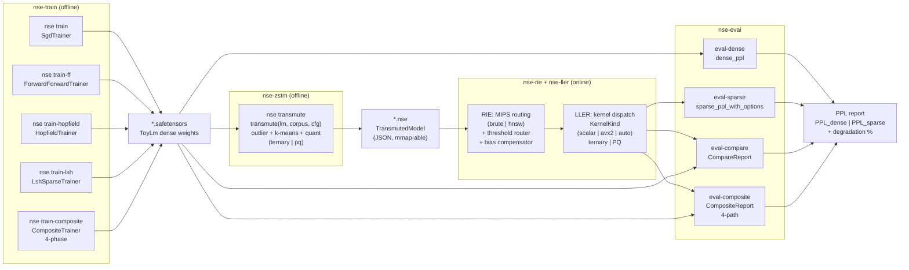
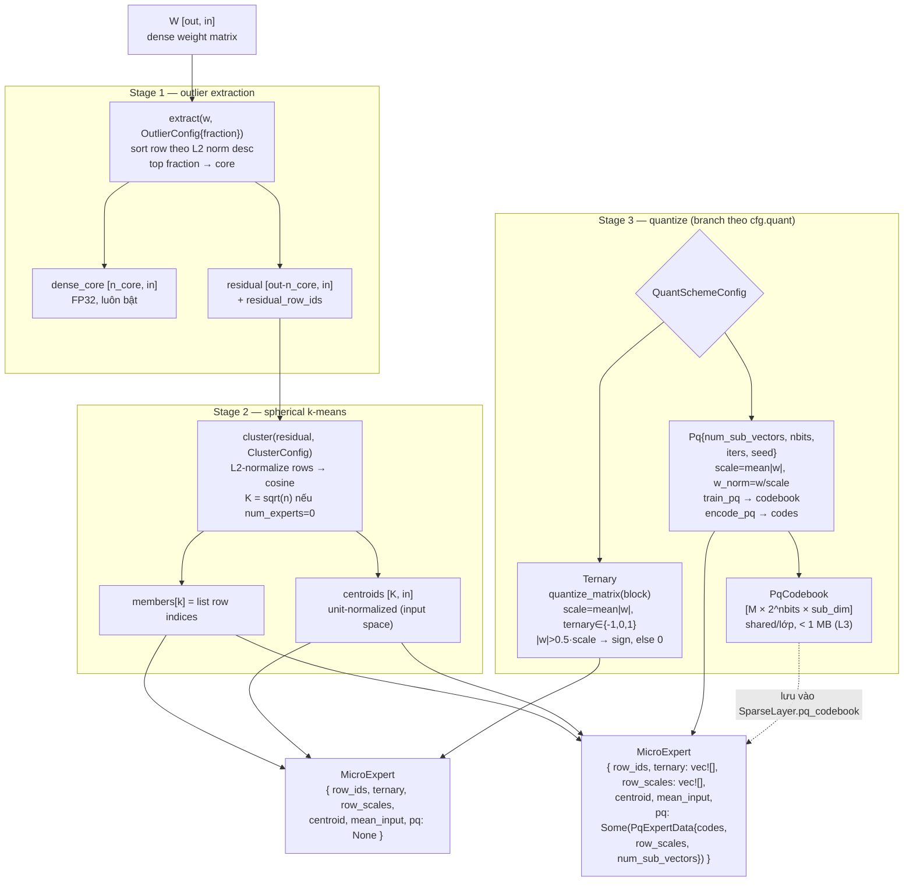
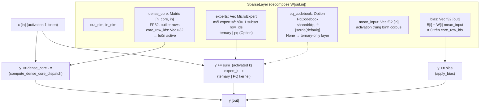
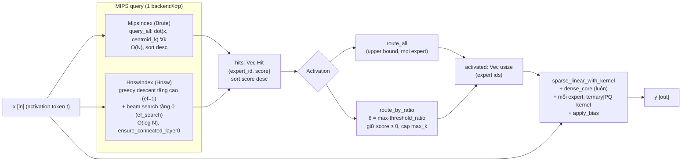
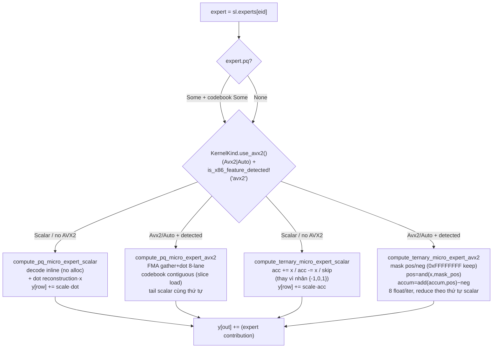
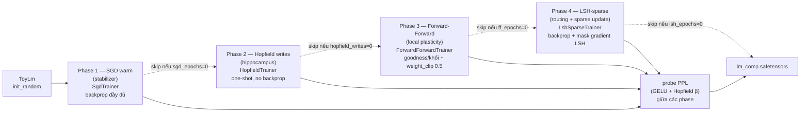
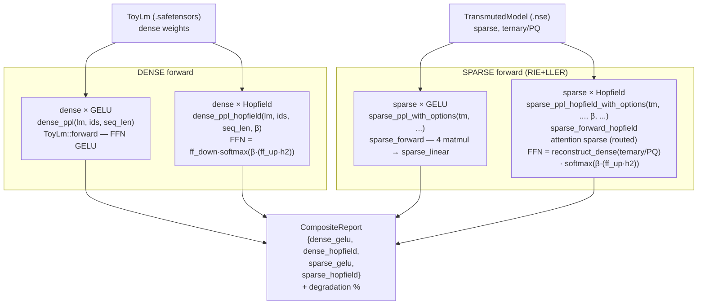

# NSE — Sơ đồ kiến trúc (phương tiện phi ngôn ngữ)

Tài liệu này là **tham chiếu thị giác** cho kiến trúc Neuro-Sparse Engine, dùng mermaid +
ASCII art để mô tả cấu trúc mà không phụ thuộc ngôn ngữ tự nhiên — bổ sung cho
`ARCHITECTURE.md` / `PAPER.md`. Mỗi sơ đồ có chú thích tiếng Việt + thuật ngữ kỹ thuật
tiếng Anh và một dòng giải thích "xem ở đâu".

> Quy ước: mọi tên struct/field/function đều lấy trực tiếp từ mã nguồn
> (`nse-zstm`, `nse-core`, `nse-rie`, `nse-ller`, `nse-eval`, `nse-train`,
> `nse-cli`) — không bịa.

---

## 1. Pipeline cấp cao (high-level pipeline)

**Chú thích:** dòng chảy end-to-end từ huấn luyện → biến đổi thưa → suy luận thưa →
báo cáo PPL, qua 4 crate chính. Artifact trung gian: `.safetensors` (dense)
→ `.nse` (sparse) → PPL report.

**Xem ở đâu:** `nse-cli/src/cli.rs` — các subcommand `Train*` → `Transmute` → `Eval*`.



> Pipeline chạy được: `train*` → `.safetensors` → `transmute --quant ternary|pq`
> → `.nse` → `eval-* --kernel scalar|avx2|auto --index brute|hnsw` → PPL.

---

## 2. ZSTM 3-stage (outlier → cluster → quantize branch)

**Chú thích:** `transmute_matrix(W[out,in])` chia thành 3 giai đoạn: (1) trích outlier
→ dense core + residual, (2) k-means cầu → micro-experts, (3) nhánh lượng tử hóa
— Ternary (mặc định) HOẶC PQ (M8) — cùng nuôi `MicroExpert`.

**Xem ở đâu:** `nse-zstm/src/transmuter.rs::transmute_matrix` + `build_ternary_experts`
/ `build_pq_experts`.



> Lưu ý M (số sub-vector) có fallback: `in_dim` không chia hết → dùng ước số lớn
> nhất `<= M` (vd dim=30, M=4 → M=3); prime → M=1 = VQ thuần. Bias `B[i]=W[i]·mean_input`
> zero trên core rows — scheme-agnostic (dùng W gốc, không dùng dạng quantized).

---

## 3. Cấu trúc SparseLayer (4 thành phần + forward)

**Chú thích:** `SparseLayer` = dạng thưa của một `W[out,in]`, gồm 4 phần: dense_core
(FP32 luôn bật), experts[] (ternary hoặc pq), bias[out] (bù expert bị prune), pq_codebook
(shared, Option). Forward ghép cả bốn.

**Xem ở đâu:** `nse-core/src/sparse.rs::SparseLayer` + `nse-rie/src/lib.rs::
sparse_linear_with_kernel`.



```
y = W_core · x  +  Σ_{k activated} (W_expert_k · x)  +  bias
    ─────────     ─────────────────────────────────     ─────
     dense core       micro-experts (ternary/PQ)        bù pruned
     (FP32, L1)       (quantized, kích hoạt động)        (mean-input)
```

> Bất biến: `covered_rows() = core_row_ids.len() + Σ e.row_ids.len() == out_dim`.
> Degradation vs dense đến từ (1) lượng tử hóa expert + (2) bias dùng mean-input
> thay x thật của token.

---

## 4. Bố cục bộ nhớ PQ codebook (ASCII) + luồng encode/decode

**Chú thích:** codebook 3D phẳng `[subvec m][centroid c][dim j]`, kích thước
`M × 2^nbits × sub_dim` floats. Index tuyến tính
`codebook[m * num_entries * sub_dim + c * sub_dim + j]` (nbits=8 → num_entries=256).

**Xem ở đâu:** `nse-core/src/sparse.rs::PqCodebook` + `nse-zstm/src/pq.rs` (`train_pq`,
`encode_pq`, `decode_pq`).

```
PqCodebook.codebook: Vec<f32>   size = M · 256 · sub_dim   (nbits=8 → 2^8=256 centroids/sub-codebook)

       m=0                                   m=1                          m=M-1
 ┌─────────────────────────────────┬─────────────────────────────┬─── ... ───┐
 │  c=0    c=1    c=2    ...  c=255 │  c=0    c=1   ...  c=255    │   ...     │
 │ [sD f] [sD f] [sD f]       [sD f]│ [sD f] [sD f]      [sD f]   │           │
 └─────────────────────────────────┴─────────────────────────────┴─── ... ───┘
  offset = m·256·sub_dim  +  c·sub_dim  +  j          (j = 0..sub_dim-1)

     sub_dim = in_dim / M        (M = num_sub_vectors, fallback nếu in_dim ∤ M)
     centroid c của subvec m:  codebook[m*256*sub_dim + c*sub_dim .. +sub_dim]
```

**Encode (1 row → M bytes):**
```
 w[0..in_dim-1],  scale = mean(|w|),   w_norm = w / scale
 ┌── subvec m=0 ──┬── subvec m=1 ──┬─ ... ─┬── subvec m=M-1 ──┐
 │ w_norm[0:sD]   │ w_norm[sD:2sD] │  ...  │ w_norm[(M-1)sD:M·sD]│
 └───────┬────────┴───────┬────────┴── ... ─┴─────────┬─────────┘
  nearest centroid    nearest centroid         nearest centroid
  (L2² vs 256)        (L2² vs 256)            (L2² vs 256)        ← kmeans_l2 (Euclid)
        ▼                    ▼                        ▼
     code[0]              code[1]                 code[M-1]         (1 byte/subvec)
                         → M bytes (1 row)   codes[i*M..(i+1)*M]
```

**Decode (codes[M] + scale → recon row):**
```
  for m in 0..M:  recon_sub[m] = codebook[m, codes[m], 0..sub_dim-1]
  recon_row = scale · concat(recon_sub[0], recon_sub[1], ..., recon_sub[M-1])   → in_dim floats
            = row_scales[i] · decode_pq(codes[i*M..(i+1)*M])
```

> PQ train per-sub-vector L2 k-means (trọng số centered ~0 → Euclid, không phải
> cosine như routing centroid ở cluster.rs). 256 level/subvec vs ternary 3 level
> → MSE thấp hơn ~1.10× (bảng 5.7.3 paper).

---

## 5. RIE routing (MIPS brute vs HNSW → threshold → bias)

**Chú thích:** mỗi token, truy vấn MIPS (brute-force HOẶC HNSW) trên centroid expert
→ hits sort giảm dần → router (`route_all` hoặc `route_by_ratio`) → activated expert
ids → `sparse_linear_with_kernel` → bias compensator.

**Xem ở đâu:** `nse-rie/src/lib.rs::sparse_linear_with_kernel`, `index.rs`,
`hnsw.rs`, `router.rs`; gọi từ `nse-eval/src/sparse_forward.rs::sparse_linear_seq`.



> Brute = canonical chính xác; HNSW = xấp xỉ (recall@k=1 trên đồ thị nhỏ nhờ
> `ensure_connected_layer0` BFS, value thật ở quy mô lớn). Cả hai chỉ đổi *cách*
> đánh giá, không kết quả PPL (chỉ FP noise) — bảng 5.2 paper.

---

## 6. LLER kernel dispatch (PQ vs ternary × scalar vs AVX2)

**Chú thích:** trong `sparse_linear_with_kernel`, mỗi activated expert dispatch theo
`expert.pq`: `Some` → PQ kernel (decode codebook + dot), `None` → ternary kernel
(add/sub/skip). `KernelKind {Scalar, Avx2, Auto}` chọn vô hướng hay SIMD.

**Xem ở đâu:** `nse-rie/src/lib.rs` (match), `nse-ller/src/avx2.rs` (`*_dispatch`,
`KernelKind`), `nse-ller/src/kernel.rs` (scalar reference).



```
Dispatch thật (sparse_linear_with_kernel, per expert):
  match (expert.pq, sl.pq_codebook):
    (Some(_), Some(cb)) → compute_pq_micro_expert_dispatch(expert, x, y, cb, kind)
    (Some(_), None)     → skip  (defensive: codebook thiếu → degrade gracefully)
    (None,    _)        → compute_ternary_micro_expert_dispatch(expert, x, y, kind)
```

> AVX2 **không** bit-identical với vô hướng (FP non-associativity), match trong
> tolerance ~1e-5 — scalar là ground-truth cho PPL. Dense core dùng FMA đầy đủ
> (7.2× speedup); ternary chỉ 1.4× (mask/blend overhead). PQ AVX2 FMA chặt
> codebook lookup → 1.92× vs ternary AVX2 (dim=64, bảng 5.7.3).

---

## 7. Composite trainer 4-phase (default vs full)

**Chú thích:** `CompositeTrainer` chạy tuần tự 4 phase qua `Trainer` trait, mỗi phase
một vai (stabilizer / hippocampus / plasticity / routing). Mỗi phase skip khi
epoch/write = 0. **Default = FF 15 + LSH 15** (skip SGD + Hopfield).

**Xem ở đâu:** `nse-train/src/composite.rs::CompositeTrainer::train` +
`CompositeConfig::default`.



```
DEFAULT (CompositeConfig::default):          FULL 4-phase (CLI flags):
  sgd_warm.epochs      = 0   (off)             --sgd-epochs 20      → bật Phase 1
  hopfield.num_writes  = 0   (off)             --hopfield-writes 64 → bật Phase 2
  ff.epochs            = 15  (warm-start)       --ff-epochs 15        (clip 0.5)
  lsh.epochs           = 15  (fine-tune)        --lsh-epochs 15       (frac 0.01)
  ff.weight_clip       = 0.5 (sweet spot §5.4)
  lsh.sparse_fraction  = 0.01
  → "FF 15 + LSH 15" (paper §5.4.2 hybrid)      → SGD warm cạnh tranh vai stabilizer
```

> Theo phát hiện §5.4.2: FF warm-start + LSH fine-tune là tổng hợp hiệu quả;
> SGD warm cạnh tranh vai stabilizer với FF, Hopfield writes có mismatch dense-PPL
> (§5.4.3) nên off mặc định. Composite thắng từng trainer riêng, không thắng SGD
> (backprop đầy đủ mạnh nhất).

---

## 8. Đánh giá 4-path (dense/sparse × GELU/Hopfield)

**Chú thích:** `compare_composite` (§5.6) chạy 4 đường forward = {dense, sparse}
× {GELU, Hopfield-retrieval}, mỗi cell đo một thứ riêng. Đây là artifact chính
của kiến trúc tổng hợp (M7).

**Xem ở đâu:** `nse-eval/src/compare.rs::compare_composite` → `CompositeReport`,
gọi `nse-eval/src/sparse_forward.rs` (`sparse_forward`, `sparse_forward_hopfield`)
+ `nse-eval/src/ppl.rs` (`dense_ppl`, `dense_ppl_hopfield`).



| Ô | Forward path | Hàm | Mô tả / đo gì |
|----|--------------|-----|---------------|
| dense × GELU | standard dense | `dense_ppl` | **baseline** — PPL tham chiếu của dense model |
| sparse × GELU | sparse matmul | `sparse_ppl_with_options` | **chi phí lượng tử hóa** — ternary/PQ cost (all-experts → chỉ quant error) |
| dense × Hopfield | dense retrieval | `dense_ppl_hopfield` | **trần retrieval** — retrieval trên key chưa quantize |
| sparse × Hopfield | sparse retrieval | `sparse_ppl_hopfield_with_options` | **retrieval trên key đã quantize** — ternary phá cosine? (§5.6 negative result) |

> Trục ngang = model (dense vs sparse): đo chi phí lượng tử hóa. Trục dọc =
> forward path (GELU vs Hopfield): đo giá trị retrieval. Sparse Hopfield trên
> ternary keys = negative result (52.61 vs sparse GELU 28.63, +84%) — ternary
> `{-1,0,1}` làm mờ khoảng cách cosine của `ff_up` keys → softmax phẳng.

---

## Phụ lục: ánh xạ crate → sơ đồ

| Crate | Sơ đồ liên quan |
|-------|-----------------|
| `nse-cli` | 1 (subcommands) |
| `nse-train` | 1 (train), 7 (composite 4-phase) |
| `nse-zstm` | 2 (3-stage), 4 (PQ codebook) |
| `nse-core` | 3 (SparseLayer structs), 4 (PqCodebook layout) |
| `nse-rie` | 5 (routing), 6 (dispatch caller) |
| `nse-ller` | 6 (kernel scalar/AVX2) |
| `nse-eval` | 8 (4-path), 1 (eval), 3 (forward combine) |
| `nse-models` | 1 (ToyLm/safetensors), 8 (dense_ppl_hopfield) |
